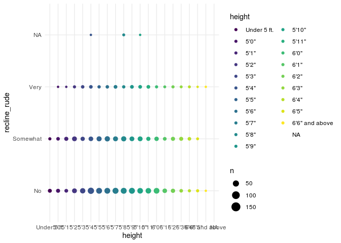
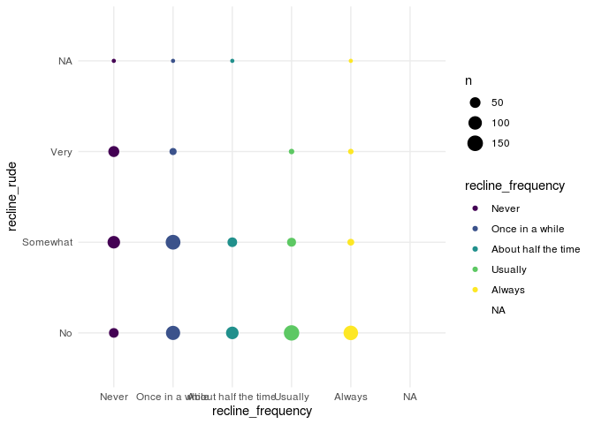
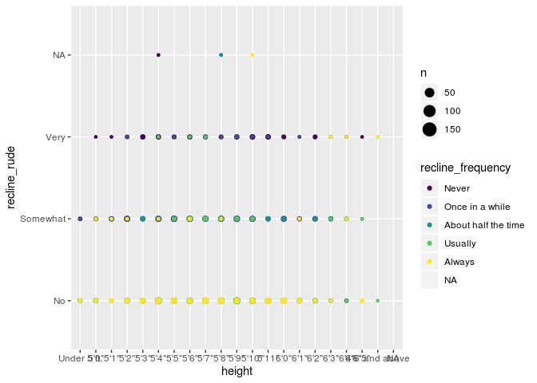
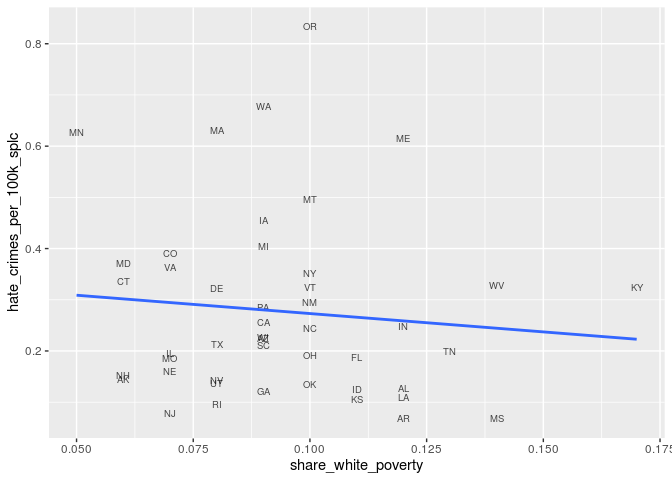

```r
library(moderndive)
library(skimr)
library(GGally)
library(openintro)
library(broom) 
library(tidyverse)
library(alr4)
library(ggmosaic)
library(ggridges)
library(fivethirtyeight)
```

## San Andreas Fault


```r
san_andreas %>% 
  ggplot() +
  geom_bar(aes(x = worry_bigone, fill = region))
```

<!-- -->


```r
san_andreas %>% 
  ggplot() +
  geom_jitter(aes(x = age, y = experience, color = prepared))
```

<!-- -->


```r
san_andreas %>% 
  ggplot() +
  geom_bar(aes(x = fam_san_andreas, fill = worry_bigone))
```

<!-- -->

## Hate Crimes


```r
hc<-hate_crimes[-c(9),] #observation 9 (DC) produced to much interference when combined with other data states. Also doesn't count as a state, so thought it would be best to remove it's data from data wrangling 

hc
```

```
## # A tibble: 50 x 13
##    state state_abbrev median_house_inc share_unemp_seas share_pop_metro
##    <chr> <chr>                   <int>            <dbl>           <dbl>
##  1 Alab… AL                      42278            0.06             0.64
##  2 Alas… AK                      67629            0.064            0.63
##  3 Ariz… AZ                      49254            0.063            0.9 
##  4 Arka… AR                      44922            0.052            0.69
##  5 Cali… CA                      60487            0.059            0.97
##  6 Colo… CO                      60940            0.04             0.8 
##  7 Conn… CT                      70161            0.052            0.94
##  8 Dela… DE                      57522            0.049            0.9 
##  9 Flor… FL                      46140            0.052            0.96
## 10 Geor… GA                      49555            0.058            0.82
## # … with 40 more rows, and 8 more variables: share_pop_hs <dbl>,
## #   share_non_citizen <dbl>, share_white_poverty <dbl>, gini_index <dbl>,
## #   share_non_white <dbl>, share_vote_trump <dbl>,
## #   hate_crimes_per_100k_splc <dbl>, avg_hatecrimes_per_100k_fbi <dbl>
```

```r
hc %>% 
  ggplot(aes(x=median_house_inc, y=hate_crimes_per_100k_splc))+ #Southern Poverty Law Center
  geom_text(aes(label=state_abbrev),
            alpha=0.7,size=2.5) +
  geom_smooth(se = FALSE, method = "lm")
```

```
## Warning: Removed 4 rows containing non-finite values (stat_smooth).
```

```
## Warning: Removed 4 rows containing missing values (geom_text).
```

<!-- -->

```r
hc %>% 
  ggplot(aes(x=gini_index, y=hate_crimes_per_100k_splc))+ #Southern Poverty Law Center
  geom_text(aes(label=state_abbrev),
            alpha=0.7,size=2.5) +
  geom_smooth(se = FALSE, method = "lm")
```

```
## Warning: Removed 4 rows containing non-finite values (stat_smooth).

## Warning: Removed 4 rows containing missing values (geom_text).
```

<!-- -->

```r
hc %>% 
  ggplot(aes(x = share_non_white, y = hate_crimes_per_100k_splc))+
  geom_text(aes(label=state_abbrev),
            alpha=0.7,size=2.5) +
  geom_smooth(se = FALSE, method = "lm")
```

```
## Warning: Removed 4 rows containing non-finite values (stat_smooth).
```

```
## Warning: Removed 4 rows containing missing values (geom_text).
```

<!-- -->

```r
hc %>% 
  ggplot(aes(x = share_white_poverty, y = hate_crimes_per_100k_splc))+
  geom_text(aes(label=state_abbrev),
            alpha=0.7,size=2.5) +
  geom_smooth(se = FALSE, method = "lm")
```

```
## Warning: Removed 4 rows containing non-finite values (stat_smooth).

## Warning: Removed 4 rows containing missing values (geom_text).
```

<!-- -->

```r
hc %>% 
  ggplot(aes(x = share_unemp_seas, y = hate_crimes_per_100k_splc))+
  geom_text(aes(label=state_abbrev),
            alpha=0.7,size=2.5) +
  geom_smooth(se = FALSE, method = "lm")
```

```
## Warning: Removed 4 rows containing non-finite values (stat_smooth).

## Warning: Removed 4 rows containing missing values (geom_text).
```

<!-- -->


